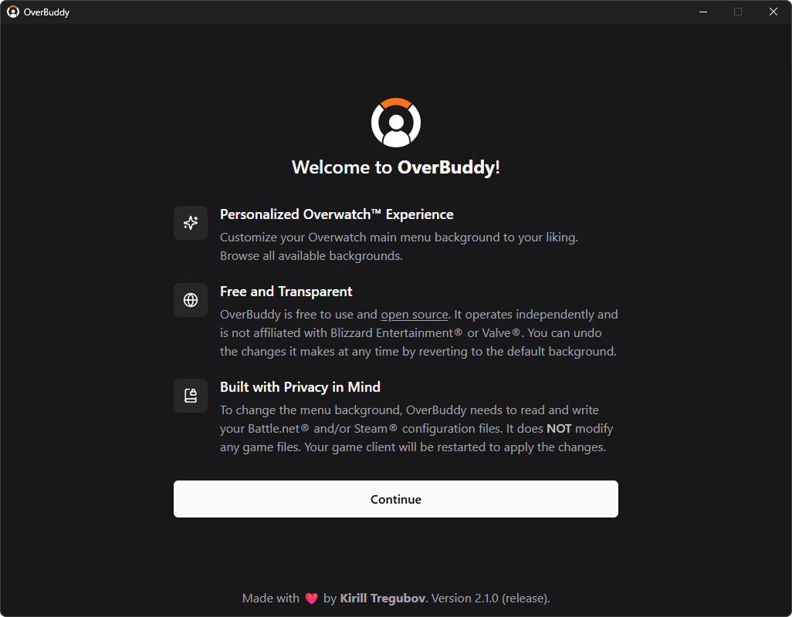
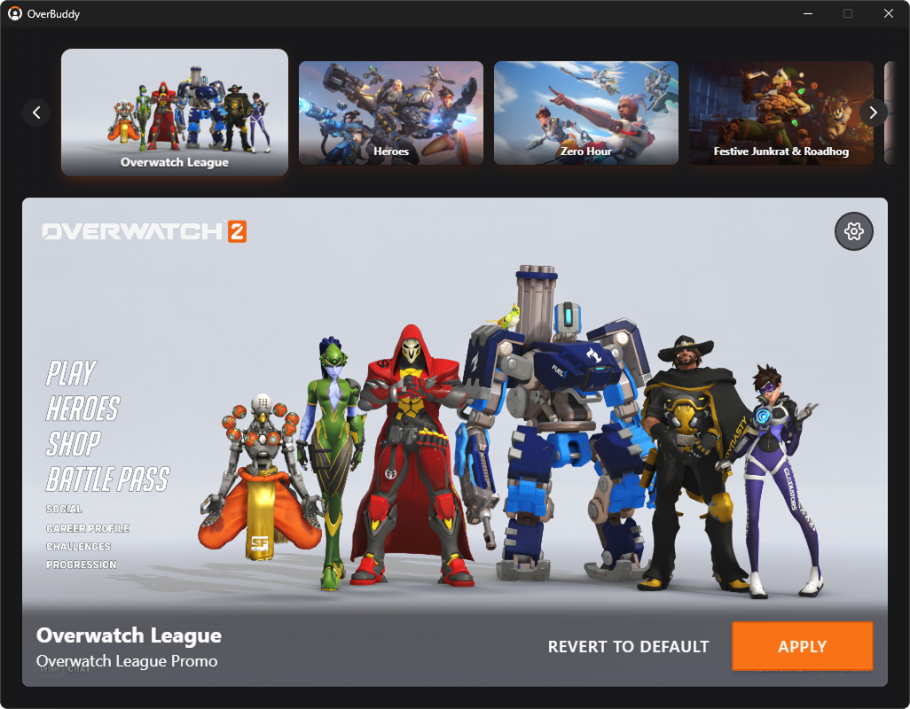

    
    <h1>OverBuddy</h1>
    
Customize your Overwatch™ 2 in-game main menu background.

    
Current Version: 1.4.3

    

      <a href="https://github.com/KirillTregubov/OverBuddy/releases/latest">Download</a>
      ·
      <a href="https://kirilltregubov.com/overbuddy#gallery">Background Gallery</a>
      ·
      <a href="https://github.com/KirillTregubov/OverBuddy/issues/new">Report Issue</a>
    

 

## Table of Contents

- [Screenshots](#screenshots)
- [Description](#description)
- [Features](#features)
- [Privacy Notice](#privacy-notice)
- [Inspiration](#inspiration)
- [Installation](#installation)
- [How to Use](#how-to-use)
- [License](#license)
- [Legal](#legal)

## Screenshots

---

## Description

OverBuddy is a free and open source Windows application that allows Overwatch™ 2 players to easily customize their in-game main menu background. Say goodbye to the default look and have a personalized Overwatch™ main menu.

## Features

- Supports Battle.net® installations of Overwatch™ 2 on Windows
- Browse all available backgrounds for the in-game menu
- Select a menu background to see a preview and more information about it
- Apply your favourite menu background
- Easily revert to the default background

## Privacy Notice

- **Reads and Writes Configuration**: OverBuddy needs to read and write your Battle.net configuration files to change your background. Game files are **NOT** modified and personal data is **NOT** collected.
- **Automatic Client Restart**: Changes are applied after automatically restarting your Battle.net client.

## Inspiration

As with all software, OverBuddy is built on the shoulders of giants.

I would like to extend my gratitude to [Toyz](https://github.com/Toyz) for publishing the [Overwatch command line arguments](https://gist.github.com/Toyz/30e6fd504c713511f67f1a607025b0bc), to [SkyBorik](https://steamcommunity.com/id/MRPRP30) for showing the community [How to change Main Menu background](https://steamcommunity.com/sharedfiles/filedetails/?id=3099694051), and to the [OverTools Team](https://github.com/overtools) for their [OWLib tool](https://github.com/overtools/OWLib).

## Installation

Download the [latest version](https://github.com/KirillTregubov/OverBuddy/releases/latest) of OverBuddy and run the installer.

## How to Use

1. Launch OverBuddy and follow the instructions to set up the application.

2. Browse all available backgrounds and select your favourite one.

3. Click the `Apply` button to change your background.

## License

OverBuddy is licensed under the [GNU General Public License v3.0](LICENSE).

## Legal

OverBuddy is in no way affiliated with, authorized, maintained, sponsored or endorsed by Blizzard Entertainment, Inc. or any of its affiliates or subsidiaries. This is an independent and unofficial application. All trademarks are the property of their respective owners.

#### Overwatch™

®2016 Blizzard Entertainment, Inc. All rights reserved. Overwatch is a trademark or registered trademark of Blizzard Entertainment, Inc. in the U.S. and/or other countries.

#### Battle.net®

©1996 - 2014 Blizzard Entertainment, Inc. All rights reserved. Battle.net and Blizzard Entertainment are trademarks or registered trademarks of Blizzard Entertainment, Inc. in the U.S. and/or other countries.
